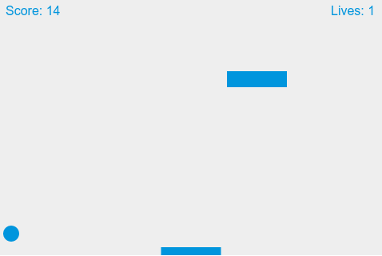

# breakout-js

Joguinho Breakout em Javascript puro da MDN

## Movimento da barra
Com as setas para a esquerda e para a direita

## Tutorial

https://developer.mozilla.org/en-US/docs/Games/Tutorials/2D_Breakout_game_pure_JavaScript/Create_the_Canvas_and_draw_on_it

## Licença

Vide tutorial

## Obs

Caso queira uma versão maior e traduzida veja abaixo na pasra www

https://github.com/ribafs/breakout

## Outros jogos aqui
- https://github.com/ribafs?tab=repositories&q=game&type=&language=&sort=
